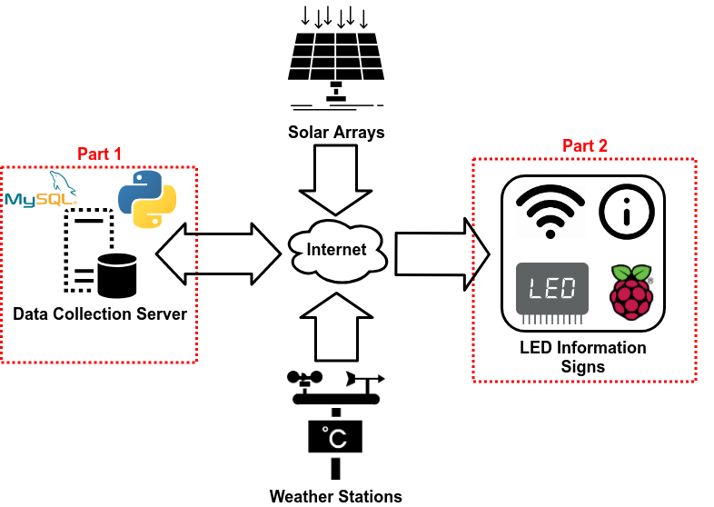

# Solar Garden Data Collection, Analysis, and LED Signage Project
Senior Design project for Computer Engineering degree at Western Michigan University. The Educational Solar Garden at WMU has been lacking both the real-time, continuous data analysis of the available weather and solar data collected and a means of displaying current system performance. This project has implemented a single server and database where solar and weather data is collected and new software performs solar data analytics. The resulting information is then directly displayed on an LED information sign to inform the public about the real-time performance of the Solar Garden. The outcome of this project greatly enhances the ability of WMU faculty and students to study the behavior of our educational solar arrays while also providing highly visible public information on their performance.

